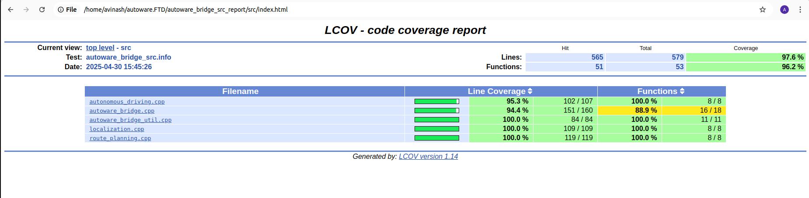

# autoware_bridge 

**Repository working as a bridge between UI_bridge and Autoware**


## Table of Contents

- [About](#about)  
- [Features](#features)  
- [Requirements](#requirements)  
- [Installation & Build](#installation--build)  
- [Usage](#usage)  
- [Testing](#testing)  
- [Contributing](#contributing)  
- [License](#license)   


## About

`autoware_bridge` is a ROS 2 node that orchestrates task execution between a user interface (`UI_bridge`) and the core Autoware modules (localization, route planning, autonomous driving). It handles:

- Task request subscriptions  
- Asynchronous task execution  
- Cancellation requests  
- Status queries via ROS 2 service  
- Periodic health checks (e.g. localization quality)  

## Features

- **Localization**, **Route Planning**, and **Autonomous Driving** task handling  
- Task rejection if another task is already running  
- Publish task status and cancellation responses  
- Automatic reinitialization requests when localization quality degrades  
- ROS 2 service to query current task status  

## Requirements

- ROS 2 Humble (or later)  
- C++  
- Dependencies listed in [`package.xml`](package.xml):  
  - `rclcpp`, `std_msgs`, `geometry_msgs`, `diagnostic_msgs`, `ftd_master_msgs`, `tier4_system_msgs`  
  - `ament_cmake`, `ament_lint_auto`, etc.  

## Installation & Build

```bash
# Clone into your workspace
# Clone standalone via SSH
git clone git@github.com:Futu-reADS/autoware_bridge.git
# Or, you can git clone via HTTPS as well
git clone https://github.com/Futu-reADS/autoware_bridge.git

# Clone via autoware.repos
# Please make entry in autoware.repos present inside autoware.FTD in proper format (following others)
# Using SSH (needs SSH key pair),
vcs import --recursive src < {WHERE-autoware.FTD-IS}/autoware.repos
# Or, using HTTPS (needs GitHub Personal Access Token),
sed 's/url:[[:space:]]*git@github\.com:/url: https:\/\/github.com\//' \
  {WHERE-autoware.FTD-IS}/autoware.repos \
  | vcs import --recursive src
# Update
vcs pull

# Install dependencies
rosdep install --from-paths src --ignore-src -r -y

# Build
colcon build --packages-select autoware_bridge --cmake-clean-cache
```

## Usage

1. Source your workspace:  
   ```bash
   source ~/your_ws/install/setup.bash
   ```
2. Launch the bridge node:  
   ```bash
   ros2 run autoware_bridge autoware_bridge_node
   ```
3. Send a task request:  
   ```bash
   # Localization example
   ros2 topic pub /ftd_master/localization_request \
     ftd_master_msgs/PoseStampedWithTaskId "{ task_id: 'loc1', pose_stamped: { /* ... */ } }"
   ```
4. Monitor responses:  
   ```bash
   ros2 topic echo /autoware_bridge/task_response
   ros2 topic echo /autoware_bridge/cancel_task_response
   ros2 topic echo /autoware_bridge/reinitialize
   ```
5. Query status via service:  
   ```bash
   ros2 service call /check_task_status autoware_bridge/srv/GetTaskStatus "{ task_id: 'loc1' }"
   ```

## Testing(GTEST)

```bash
  This package includes a comprehensive ament_gtest suite under test/. To run all tests:
# From the root of your workspace:
  colcon build --packages-select autoware_bridge --cmake-clean-cache
  colcon test --packages-select autoware_bridge
  colcon test-result --verbose
  
  Code coverage is also integrated with this package and For code coverage you can use below command 
  then one url will open and will show the line coverage
  
  lcov --capture --directory build/autoware_bridge --output-file coverage.info
  lcov --remove coverage.info '/usr/*' '*/test/*' --output-file coverage_filtered.info
  lcov --extract coverage_filtered.info '*/autoware_bridge/src/*.cpp' --output-file autoware_bridge_src.info
  genhtml autoware_bridge_src.info --output-directory autoware_bridge_src_report
  xdg-open autoware_bridge_src_report/index.html

Recomended: run one class test at a time by commenting out all other classes in CMakeLists.txt
```


## Contributing

1. Fork this repository  
2. Create a feature branch  
3. Commit and push your changes  
4. Open a Pull Request  

Please follow the existing code style and add new tests for any behavior you introduce.

## License

This project is licensed under the [Apache License 2.0](LICENSE).
